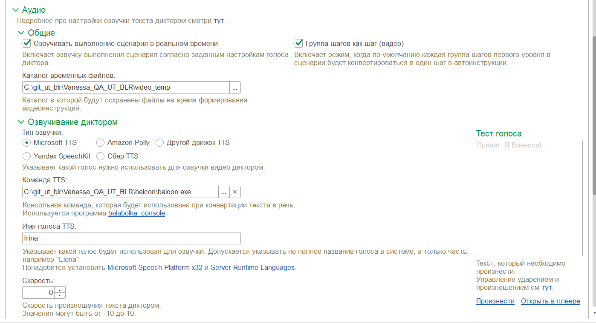

# **Настройки для написания видеоинструкций**

### (не web-клиенте)

Из [инструкции](https://github.com/Pr-Mex/vanessa-automation/blob/develop/docs/FAQ/MakeAutoVideo.md), в разделе [установка ПО](https://github.com/Pr-Mex/vanessa-automation/blob/develop/docs/FAQ/MakeAutoVideo.md#%D1%83%D1%81%D1%82%D0%B0%D0%BD%D0%BE%D0%B2%D0%BA%D0%B0), чуть устаревшая информация.

В [пакете ImageMagick](https://imagemagick.org/script/download.php#windows) , видно произошли изменения и в поставке уже не идет ffmpeg.

- Скачиваем отдельно [ImageMagick](https://imagemagick.org/script/download.php#windows) и ffmpeg(я скачивал [отсюда](https://www.gyan.dev/ffmpeg/builds/)).

- Производим установку.

- Затем необходимо прописать путь в Path.

Дальнейшие настройки можно выполнить согласно [инструкции](https://github.com/Pr-Mex/vanessa-automation/blob/develop/docs/FAQ/MakeAutoVideo.md#%D0%BE%D0%B1%D1%89%D0%B8%D0%B5-%D0%BD%D0%B0%D1%81%D1%82%D1%80%D0%BE%D0%B9%D0%BA%D0%B8).

# Пример видеоинструкции сценария

- Пример [фича файла](https://github.com/serg-lom89/Vanessa_QA_UT_BLR/blob/main/video/%D0%9F%D1%80%D0%B8%D0%BC%D0%B5%D1%80%D1%8B%20%D1%81%D1%86%D0%B5%D0%BD%D0%B0%D1%80%D0%B8%D0%B5%D0%B2/%D0%A1%D0%BE%D0%B7%D0%B4%D0%B0%D0%BD%D0%B8%D1%8F%20%D0%BF%D0%BE%D0%BB%D1%8C%D0%B7%D0%BE%D0%B2%D0%B0%D1%82%D0%B5%D0%BB%D1%8F%28%D0%B2%D0%B8%D0%B4%D0%B5%D0%BE%D0%B8%D0%BD%D1%81%D1%82%D1%80%D1%83%D0%BA%D1%86%D0%B8%D1%8F%29.feature) создания пользователя и результат в виде [видеоинструкции](https://raw.githubusercontent.com/serg-lom89/Vanessa_QA_UT_BLR/main/video/%D0%9F%D1%80%D0%B8%D0%BC%D0%B5%D1%80%20%D0%B2%D0%B8%D0%B4%D0%B5%D0%BE%D0%B8%D0%BD%D1%81%D1%82%D1%80%D1%83%D0%BA%D1%86%D0%B8%D0%B8/%D0%A1%D0%BE%D0%B7%D0%B4%D0%B0%D0%BD%D0%B8%D1%8F%20%D0%BF%D0%BE%D0%BB%D1%8C%D0%B7%D0%BE%D0%B2%D0%B0%D1%82%D0%B5%D0%BB%D1%8F%28%D0%B2%D0%B8%D0%B4%D0%B5%D0%BE%D0%B8%D0%BD%D1%81%D1%82%D1%80%D1%83%D0%BA%D1%86%D0%B8%D1%8F%29.mp4).

- Пример [фича файла](https://github.com/serg-lom89/Vanessa_QA_UT_BLR/blob/main/video/%D0%9F%D1%80%D0%B8%D0%BC%D0%B5%D1%80%D1%8B%20%D1%81%D1%86%D0%B5%D0%BD%D0%B0%D1%80%D0%B8%D0%B5%D0%B2/%D0%A1%D0%BE%D0%B7%D0%B4%D0%B0%D0%BD%D0%B8%D1%8F%20%D0%BF%D0%BE%D0%BB%D1%8C%D0%B7%D0%BE%D0%B2%D0%B0%D1%82%D0%B5%D0%BB%D1%8F(%D0%B2%D0%B8%D0%B4%D0%B5%D0%BE%D0%B8%D0%BD%D1%81%D1%82%D1%80%D1%83%D0%BA%D1%86%D0%B8%D1%8F%20%D1%81%20%D0%BE%D0%B7%D0%B2%D1%83%D1%87%D0%BA%D0%BE%D0%B9).feature) создания пользователя с **озвучкой** и результат в виде [видеоинструкции](https://raw.githubusercontent.com/serg-lom89/Vanessa_QA_UT_BLR/main/video/%D0%9F%D1%80%D0%B8%D0%BC%D0%B5%D1%80%20%D0%B2%D0%B8%D0%B4%D0%B5%D0%BE%D0%B8%D0%BD%D1%81%D1%82%D1%80%D1%83%D0%BA%D1%86%D0%B8%D0%B8/%D0%A1%D0%BE%D0%B7%D0%B4%D0%B0%D0%BD%D0%B8%D1%8F%20%D0%BF%D0%BE%D0%BB%D1%8C%D0%B7%D0%BE%D0%B2%D0%B0%D1%82%D0%B5%D0%BB%D1%8F(%D0%B2%D0%B8%D0%B4%D0%B5%D0%BE%D0%B8%D0%BD%D1%81%D1%82%D1%80%D1%83%D0%BA%D1%86%D0%B8%D1%8F%20%D1%81%20%D0%BE%D0%B7%D0%B2%D1%83%D1%87%D0%BA%D0%BE%D0%B9).mp4).Озвучено с помощью Microsoft TTS.

## Настройка озвучки с помощью  [Balabolka](https://cross-plus-a.com/bconsole.htm).
Скачать и установить [Microsoft Speech Platform - Runtime](https://www.microsoft.com/en-us/download/details.aspx?id=27225) и [Microsoft Speech Platform - Runtime Languages](https://www.microsoft.com/en-us/download/details.aspx?id=27224).

Пример настройки аудио:

  - Прописываем путь к .exe файлу
  - Указываем язык - Irina

